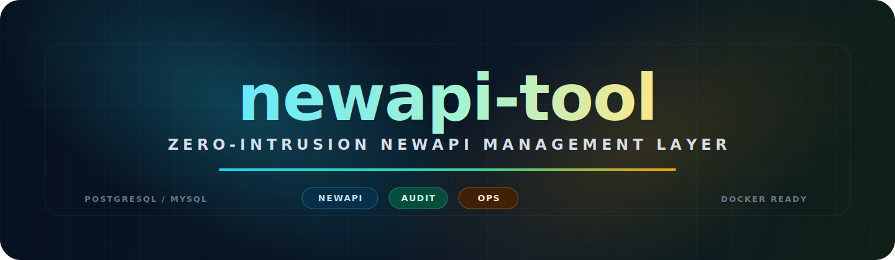

<p align="center">
  
</p>

<p align="center">
  
  
  
  
  
  
  
  
  
</p>

# NewAPI-Tool | NewAPI 增强管理中间件

**NewAPI-Tool** 是面向 [QuantumNous/new-api](https://github.com/QuantumNous/new-api) 的增强管理中间件。它以旁路方式连接 NewAPI 数据库和缓存服务，把仪表盘、充值审计、兑换码管理、风控分析、模型监控和运维配置集中到一个独立管理后台中。

它的核心原则是**零侵入运行**：不修改 NewAPI 源码，不改变 NewAPI 原有表结构，不接管 NewAPI 主服务流量；只在管理员需要审计、分析、批量处理或扩展运营能力时提供额外工作台。

## 项目信息

| 项目 | 说明 |
|---|---|
| 项目定位 | NewAPI 的增强管理层，用于可视化、审计、风控和后台运维 |
| 上游项目 | [QuantumNous/new-api](https://github.com/QuantumNous/new-api) |
| 运行方式 | 独立容器 / 独立进程，连接 NewAPI 现有数据库 |
| 默认端口 | `1145` |
| 后端栈 | Go `1.25.6`、Gin `1.11`、sqlx、Redis、SQLite 辅助缓存 |
| 前端栈 | React `19`、Vite `8`、TypeScript、Tailwind CSS、ECharts |
| 数据库 | 生产优先 PostgreSQL / MySQL，查询字段以导出的真实 schema 为准 |
| 部署入口 | `install.sh` 一键部署，或 `docker-compose.yml` 手动部署 |
| 镜像 | `ghcr.io/james-6-23/new_api_tools:latest` |

## 能力速览

| 模块 | 能力 |
|---|---|
| 统一仪表盘 | 汇总用户、令牌、渠道、模型、兑换码、请求趋势、活跃用户和系统规模。 |
| 充值审计 | 查询全量充值记录，按状态、渠道、时间和用户维度筛选，提供财务汇总、支付分布、漏斗和异常分析。 |
| 兑换码管理 | 批量生成兑换码，支持固定/随机额度、前缀、过期时间、高级筛选、复制和批量删除。 |
| 风控中心 | 查看高频请求、额度消耗、关联账号、同 IP 注册、Token 轮换、封禁记录和用户风险画像。 |
| 联合违规广播 | 接入独立 `newapi-tool-AbuseHub`，同步外部通报，本地匹配 email / OAuth / LinuxDo / IP 等身份线索，由管理员人工复核。 |
| IP 与日志分析 | 对大表 `logs` 做缓存化统计，提供 IP 分布、共享 IP、用户请求排行、模型使用和同步状态。 |
| 模型监控 | 配置模型状态看板、时间窗口、展示主题、刷新间隔、分组和可公开嵌入的模型状态页。 |
| 用户与令牌运维 | 用户列表、封禁/解封、软删除清理、令牌统计、分组预览和自动分组任务。 |

## 架构边界

- **零侵入**：NewAPI-Tool 只作为增强管理层运行，不要求改动 `new-api/` 源码。
- **不改 NewAPI schema**：所有涉及 NewAPI 数据表的查询和写入都遵循现有字段、类型和索引语义。
- **审计优先**：核心能力以查询、可视化、复核和运维辅助为主，批量写操作只覆盖明确的管理场景。
- **面向生产数据规模**：`logs` 等大表查询采用索引、缓存、超时和估算策略，避免无意义全表扫描。
- **双部署形态**：生产环境可用 PostgreSQL + Redis，单机或测试场景也可使用 SQLite / Memory 相关轻量缓存能力。

## 快速部署

### 方式一：一键脚本（推荐）

如果 NewAPI 已部署在 Linux 服务器上，可以使用一键脚本自动检测环境并部署：

```bash
bash <(curl -sSL https://raw.githubusercontent.com/james-6-23/new_api_tools/main/install.sh)
```

脚本会自动定位 NewAPI 安装目录、读取数据库配置、生成必要密钥、设置管理员密码、配置 Docker 网络并启动服务。部署完成后访问：

```text
http://your-server-ip:1145
```

### 方式二：Docker Compose 手动部署

适用于熟悉 Docker 的用户或非标准环境：

```bash
git clone https://github.com/james-6-23/new_api_tools.git
cd new_api_tools
cp .env.example .env
vim .env
docker-compose up -d
```

## 配置说明

推荐优先使用 `SQL_DSN` 配置完整数据库连接串；设置了 `SQL_DSN` 后，分离式 `DB_*` 配置会作为兼容兜底。

| 变量名 | 说明 | 示例/默认值 |
|---|---|---|
| `FRONTEND_PORT` | 对外访问端口 | `1145` |
| `FRONTEND_BIND` | 端口绑定网卡；生产反代时建议绑定本机 | `0.0.0.0` / `127.0.0.1` |
| `ADMIN_PASSWORD` | 管理后台登录密码 | 必填 |
| `API_KEY` | 前后端内部 API Key | 部署脚本自动生成 |
| `JWT_SECRET` | JWT 签名密钥 | 部署脚本自动生成 |
| `JWT_EXPIRE_HOURS` | JWT 过期时间（小时） | `24` |
| `SQL_DSN` | 推荐的完整数据库连接串 | `host=... port=5432 user=...` |
| `DB_ENGINE` | 兼容旧版分离配置的数据库类型 | `postgres` / `mysql` |
| `DB_DNS` | 数据库主机或容器服务名 | `postgres` |
| `DB_PORT` | 数据库端口 | `5432` / `3306` |
| `DB_NAME` | 数据库名称 | `new-api` |
| `DB_USER` | 数据库用户名 | `postgres` |
| `DB_PASSWORD` | 数据库密码 | 必填 |
| `DB_MAX_OPEN_CONNS` | 数据库最大打开连接数 | `50` |
| `DB_MAX_IDLE_CONNS` | 数据库最大空闲连接数 | `15` |
| `NEWAPI_NETWORK` | NewAPI 所在 Docker 网络 | `new-api_default` |
| `NEWAPI_BASEURL` | NewAPI 内部地址，用于需要回调上游的功能 | 可选 |
| `REDIS_PASSWORD` | 内置 Redis 密码 | 留空或自定义 |
| `TIMEZONE` | 服务时区 | `Asia/Shanghai` |
| `LOG_LEVEL` | 日志级别 | `info` |

## 联合违规广播接入

联合违规广播 Hub 独立部署在 `newapi-tool-AbuseHub/` 目录，默认使用 SQLite 和 `8888` 端口。Hub 管理员在 `/admin/` 创建命名密钥后，会得到一次性 `Secret`；密钥名称就是 NewAPI-Tool 侧的节点名称。

NewAPI-Tool 接入流程：

1. 进入前端「联合违规广播 → 接入状态」页，填写 Hub URL（推荐使用 `/v1/live` 后缀）、节点名称、密钥、拉取间隔，并勾选「启用拉取」后保存。
2. 配置变更立即生效，不需要重启后端进程。
3. 点击「连接 Hub」，Hub 收到心跳后会把该密钥激活为已连接节点。

之后 NewAPI-Tool 会定时拉取 `GET /v1/reports`，并把收到的通报写入本地 SQLite 缓存（`DATA_DIR/abuse-broadcast.db`），不修改 NewAPI 原有表结构。

## 本地开发

后端：

```bash
cd backend
go mod download
go run ./cmd/server
```

前端：

```bash
cd frontend
npm install
npm run dev
```

## API 端点

主要端点分组：

| 分组 | 端点 |
|---|---|
| 健康检查 | `GET /api/health`、`GET /api/health/db` |
| 认证 | `POST /api/auth/login`、`POST /api/auth/logout` |
| 仪表盘 | `GET /api/dashboard/*` |
| 充值 | `GET /api/top-ups`、`GET /api/top-ups/analytics/*` |
| 兑换码 | `GET /api/redemptions`、`POST /api/redemptions/generate` |
| 风控 | `GET /api/risk/*`、`GET /api/ip/*`、`POST /api/ai-ban/*` |
| 联合广播 | `GET /api/abuse-broadcast/*`、`POST /api/abuse-broadcast/*` |
| 模型状态 | `GET /api/model-status/*`、`GET /api/embed/model-status/*` |
| 用户与令牌 | `GET /api/users`、`GET /api/tokens`、`GET /api/auto-group/*` |
| 存储与系统 | `GET /api/storage/*`、`GET /api/system/*` |

## 数据来源说明

本项目依赖 NewAPI 既有数据结构。涉及 NewAPI 数据访问、字段含义、列类型和索引时，应优先参考仓库内的真实生产库导出：

```text
pgsql_schema_export_20260505/
```

其中 `structure.txt` 用于快速确认表和列，`schema.sql` 用于查看完整建表、索引和默认值。`new-api/` 是上游 NewAPI 源码的只读参考目录，不应在本项目提交对它的改动。

## 贡献与支持

欢迎提交 Issue 和 Pull Request。改动数据库查询时，请同时确认 PostgreSQL / MySQL 的 SQL 差异，并避免对 NewAPI 原表结构做侵入式变更。

## License

MIT License

## Star History

[](https://star-history.com/#james-6-23/new_api_tools&Date)
